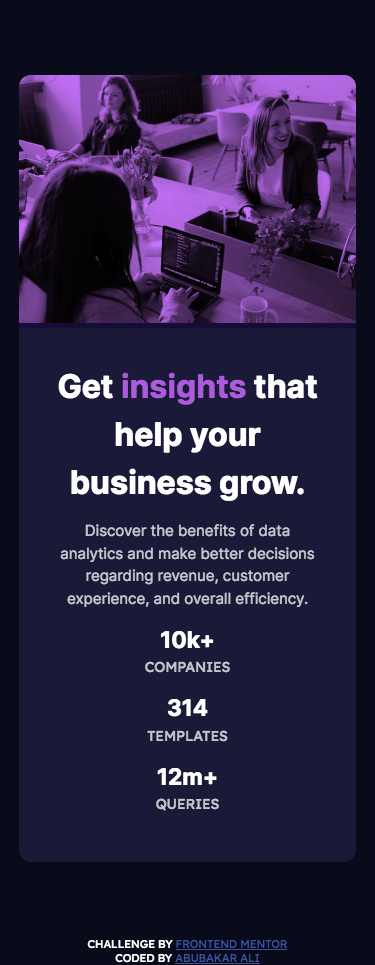

# Frontend Mentor - Stats preview card component solution

This is a solution to the [Stats preview card component challenge on Frontend Mentor](https://www.frontendmentor.io/challenges/stats-preview-card-component-8JqbgoU62). Frontend Mentor challenges help you improve your coding skills by building realistic projects. 

## Table of contents

- [Overview](#overview)
  - [The challenge](#the-challenge)
  - [Screenshot](#screenshot)
  - [Links](#links)
  - [Built with](#built-with)
  - [What I learned](#what-i-learned)
  - [Useful resources](#useful-resources)
  - [Author](#author)


## Overview

### The challenge

Users should be able to:

- View the optimal layout depending on their device's screen size

### Screenshot
## Mobile View Screenshot




## Desktop View Screenshot


s

### Links

- Solution URL: [Github Repo](https://github.com/Devabubakar/Frontend-Mentor-Stats-preview-card-component)
- Live Site URL: [Add live site URL here](https://your-live-site-url.com)


### Built with

- Semantic HTML5 markup
- CSS custom properties
- Flexbox
- CSS Grid
- Mobile-first workflow
- Sass / Scss 
- Parcel bundler


### What I learned


```css
.proud-of-this-css {
  mix-blend-mode:multiply;
  filter: contrast(0.9) brightness(1.2);
}
```


### Useful resources

- [Example resource 1](https://developer.mozilla.org) - This helped me refresh my understanding on the concept of mix blend mode and stacking context

## Author

- Website - [Abubakar Ali](https://www.github.com/Devabubakar)
- Frontend Mentor - [@Devabubakar](https://www.frontendmentor.io/profile/Devabubakar)
- Twitter - [@Devabubakar](https://www.twitter.com/Devabubakar)

